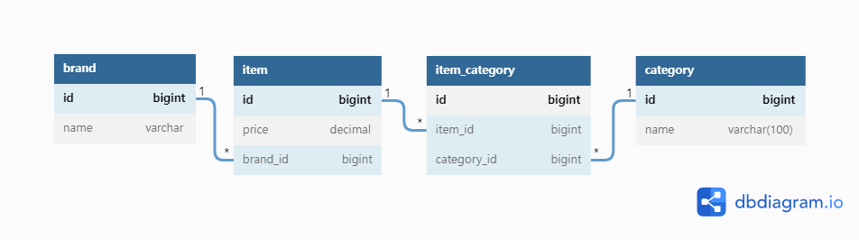
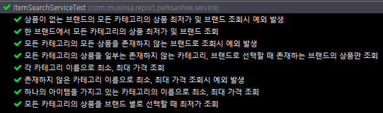

# 무신사 백엔드 채용 과제

>  제출일: 2022.07.17(일)
>
>  지원자: **박 산희** (68936@naver.com / https://github.com/sanhee)

<br>


# 기술 스택

### Java, Spring Boot, Spring Data JPA, Querydsl, H2, Redis (embedded)

<br>

# API 문서 (Heroku 배포)

### https://musinsa-shop-api-sanhee.herokuapp.com/swagger-ui/index.html#/

<br>

# 엔티티 관계 다이어그램



<br>

# 요구사항 검증 방식

- 서비스 레이어 통합 테스트를 하며, 조건을 검증하였습니다.




<br>


# 유연한 저장소 변경을 고려하여 데이터베이스 접근 기술로 JPA를 채택

- JPA는 추상화된 Dialect를 제공하여 각 벤더사에 맞게 유연하게 처리


<br>

# 빠른 응답을 고려하여 스프링 캐시 사용


- 상품의 최저가 조회의 경우 반복 요청이 많이 발생할 것으로 예상되어 느린 디스크 I/O를 해소하고자 상품 조회 데이터를 캐시하여 응답하고 있습니다.

- 캐시 저장소는 빠른 구현을 위해 [embedded-redis](https://github.com/ozimov/embedded-redis)를 사용하였습니다.

<br>

# API 응답 실패시 실패 사유 응답
- `RestControllerAdvice`를 활용하여 예외를 처리하였습니다.

```json
ex 1)

{
    "status": "BAD_REQUEST",
    "reason": "선택한 카테고리 개수(2)와 브랜드 개수(1)가 일치하지 않습니다.",
    "dateTime": "2022-07-17T05:02:33.461"
}

---------------

ex 2)

{
    "status": "NOT_FOUND",
    "reason": "조회하신 상의2 카테고리에 존재하는 상품을 찾을 수 없습니다.",
    "dateTime": "2022-07-17T05:05:47.443"
}

```
<br>

# Money 객체 정의

- 돈의 **의미를 명시적**이고 분명하게 표현할 수 있고, 금액과 관련된 로직의 **중복 최소화**할 수 있어 객체로 정의하였습니다.
- 돈 계산은 **정밀한 연산**이 필요하기 때문에, **BigDecimal** 자료형을 사용하였습니다.

<br>

<br>

# 실행 결과

- 제공된 샘플 데이터를 `data.sql`로 가공 및 삽입하여 모두 정상 동작하는 것을 확인했습니다.
- 선택 과제인 `브랜드 상품 가격 추가 / 업데이트 / 삭제 API`도 구현하였습니다.

<br>

### 한 브랜드에서 모든 카테고리의 상품을 한꺼번에 구매할 경우 최저가 및 브랜드 조회  API

```json
# Request

GET>  items/brandFilter?name=D

# Response

{
    "brandName": "D",
    "minimumPrice": 36100
}
```

<br>

### 각 카테고리 이름으로 최소, 최대 가격 조회 API

```json
# Request

GET items/categoryFilter?name=상의

# Response

{
    "minimumBrand": {
        "brandName": "C",
        "minimumPrice": 10000
    },
    "maximumBrand": {
        "brandName": "I",
        "minimumPrice": 11400
    }
}
```

<br>

### 모든 카테고리의 상품을 브랜드 별로 자유롭게 선택해서 모든 상품을 구매할 때 최저가 조회 API


```json
# Request

GET items/categoryBrandFilters?categories=상의,아우터,바지,스니커즈,가방,모자,양말,액세서리&brands=C,E,D,G,A,D,I,F

# Response

{
    "itemList": [
        {
            "categoryName": "상의",
            "brandName": "C",
            "minimumPrice": 10000
        },
        {
            "categoryName": "아우터",
            "brandName": "E",
            "minimumPrice": 5000
        },
        {
            "categoryName": "바지",
            "brandName": "D",
            "minimumPrice": 3000
        },
        {
            "categoryName": "스니커즈",
            "brandName": "G",
            "minimumPrice": 9000
        },
        {
            "categoryName": "가방",
            "brandName": "A",
            "minimumPrice": 2000
        },
        {
            "categoryName": "모자",
            "brandName": "D",
            "minimumPrice": 1500
        },
        {
            "categoryName": "양말",
            "brandName": "I",
            "minimumPrice": 1700
        },
        {
            "categoryName": "액세서리",
            "brandName": "F",
            "minimumPrice": 1900
        }
    ],
    "totalPrice": 34100
}
```