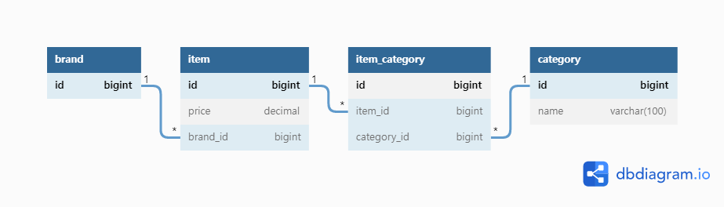

# 무신사 백엔드 과제 테스트

>  제출일: 2022.07.XX
>
>  지원자: **박 산희** (68936@naver.com / http://resume.sanhee.kro.kr/ )

 

# 기술 스택

#### Java, Spring Boot, Spring Data JPA, H2

 

# 요구사항

- [ ] 모든 카테고리의 상품을 브랜드 별로 자유롭게 선택해서 모든 상품을 구매할 때 최저가 조회 API
- [ ] 한 브랜드에서 모든 카테고리의 상품을 한꺼번에 구매할 경우 최저가 및 브랜드 조회  API
- [ ] 각 카테고리 이름으로 최소, 최대 가격 조회 API
- [ ] (선택) 브랜드 상품 가격 추가 API
- [ ] (선택) 브랜드 상품 가격 업데이트 API
- [ ] (선택) 브랜드 상품 가격 삭제 API

# ERD

